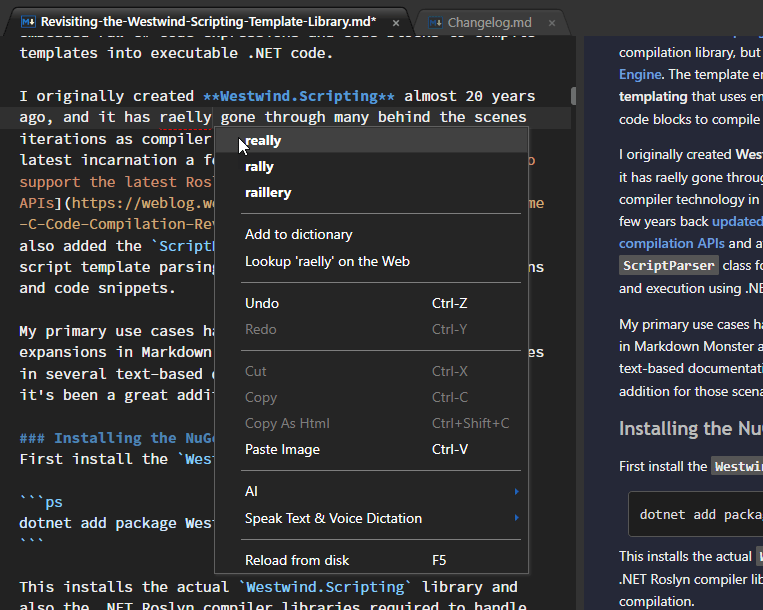
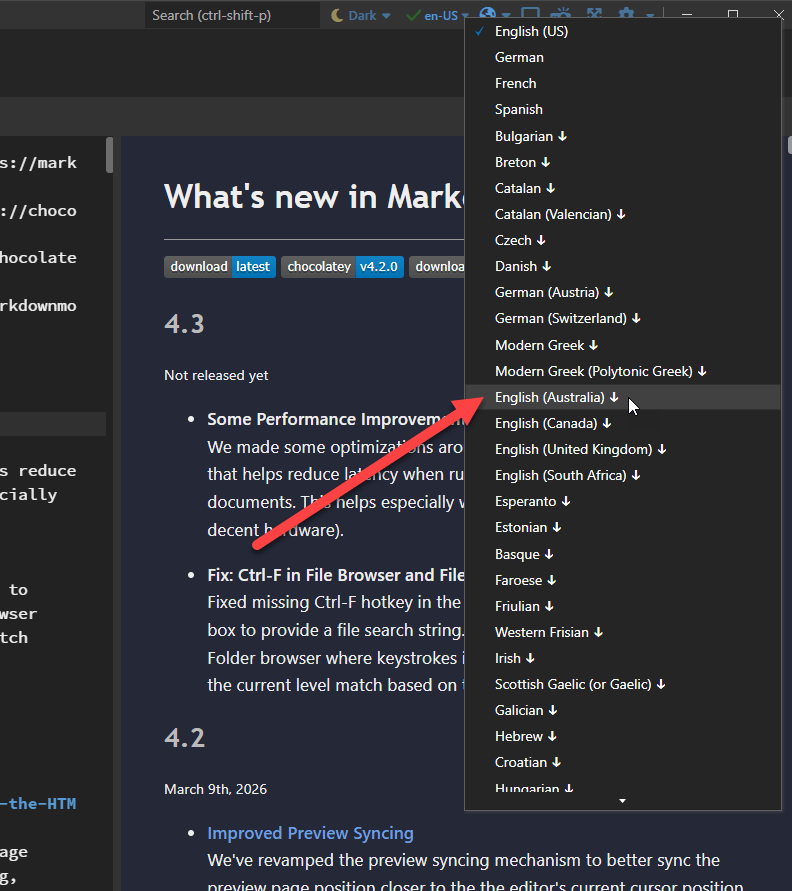

Markdown Monster includes an inline spellchecker that highlights misspelled text as you type:



Misspelled text underlines with a red, dotted line and you can right-click on the misspelled text to bring up a list of spelling suggestions. Pick one of the items to correct the misspelled word.

### Adding Words to the Dictionary
If you find misspelled words that aren't in the dictionary, but are words that shouldn't be flagged, you can add them to a custom dictionary. Once added the word added will no longer be shown as misspelled.

> The custom dictionary is stored in a custom file for the specific locale:  
> `%appdata%\Markdown Monster\DownloadedDictionaries\en-US_custom.txt`

### Turning Spell Checking On and Off
Spell checking can be turned on and off using the Spellcheck button in the Window's right hand control box:


Click to toggle between active and inactive state for spell checking. The icon shows either the check or X for current state.

The value can also be configured in the Settings:

```json
Editor {
   "EnableSpellcheck": true
}
```

### Dictionary Selection
Use the drop down next to the dictionary toggle to select from a number of supported spell checking dictionaries for different languages. 

Markdown Monster comes with 4 pre-installed dictionaries:

* en-US
* de
* fr
* es

along with 60+ additional dictionaries **that can be explicitly downloaded and installed**. 

To switch dictionaries use the drop down next to the spell checking toggle:



The down arrow means that dictionaries have to be downloaded, which happens automatically when you select a non-present dictionary.

Dictionaries are downloaded into your common folder's `DownloadedDictionaries` folder. You can delete dictionaries from there to remove them.

By default this folder is located in:

```ps
%appdata%\Markdown Monster\DownloadedDictionaries
```

### Installing a Custom Dictionary
If the dictionary you want to use isn't on the list provided you can add additional dictionaries into the `%appdata%\Markdown Monster\DownloadedDictionaries` folder.

Markdown Monster uses standard <a href="https://hunspell.github.io/" target="top">hunspell</a> dictionaries for spell checking and so can use standard <a href="http://extensions.openoffice.org/" target="top">Open Office dictionaries</a>.

To install custom dictionaries find the `.dic` and `.aff` files and save them to the `Editor` folder in the MM installation folder. Use a name that describes the locale. Once installed the new dictionary will show up on the language drop down by its filename.

### Open Office Dictionaries
If you want to add dictionaries for other languages not included on our list, you can download and install custom dictionaries that are in the standard Open Office (4.0 preferably) format. Open Office also uses hunspell and so the Open Office dictionaries are compatible. 

You can find dictionaries on the Open Office Extensions Site:

* [Open Office Dictionary Extensions](http://extensions.openoffice.org/en/search?f[0]=field_project_tags%3A157)

Here are a few direct links for some common specific libraries:

* [English (us,gb,au,ca)](http://extensions.openoffice.org/en/project/english-dictionaries-apache-openoffice)
* [Italian](http://extensions.openoffice.org/en/project/italian-dictionary-thesaurus-hyphenation-patterns)
* [Russian](http://extensions.openoffice.org/en/project/russian-dictionary)

### Using Open Office Dictionary Extensions in Markdown Monster
Open Office Extensions often come as `.oxt` (Open Office Extension) files, which are really just Zip files. You can rename the extension to `.zip`, open the archive and extract the `.dic` and `.aff` files out of it and copy to your `%appdata%\Markdown Monster\DownloadedDictionaries` folder. Name them with `en-US` style formatting (language-Dialect) and they will be found by MM.