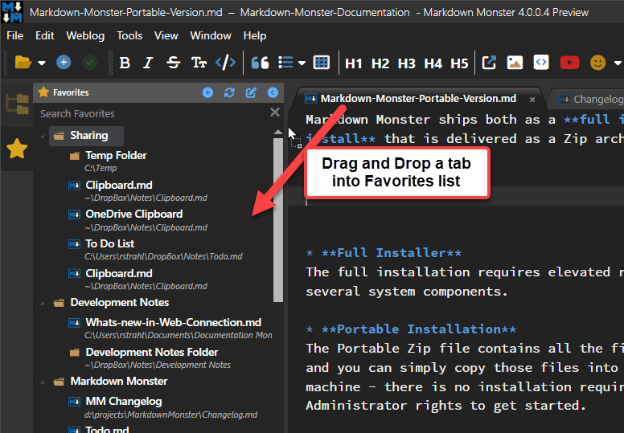
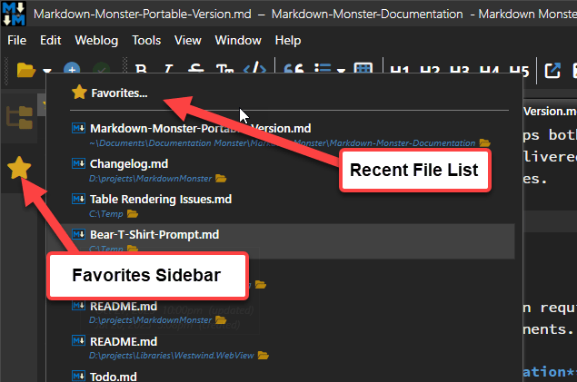
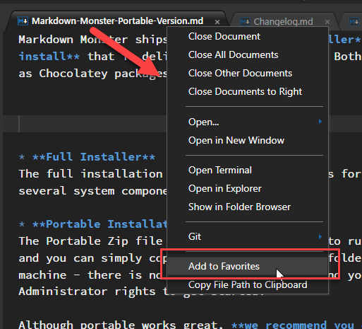

Using **Favorites** you can add any kind of file (not just Markdown Files) or folders to the Favorites list. 

I have a lot of notes and lists that I keep in Markdown files and one of the biggest annoyances has been to keep track of these often used files. Even with Markdown Monster's configurable and optionally very long recent files list, many of my frequently used files that I really want to track keep dropping off these lists.

Favorites address this issue nicely by allowing me to keep my often reused files linked in one place along with an easy way to add favorites and organize them into groups via drag and drop. 

### Favorites in Markdown Monster
Markdown Monster includes a Favorites as part of the UI. Here's what this Favorites Panel looks like:

The easiest way to get Favorites into the list is b**y dragging an open document tag into the Favorites panel**. Just drop it under a folder or into an existing list of files or folders and it'll get added there. You can also **drag and drop from Windows Explorer** (or any other Shell file tool) into the Favorites list.

You can access the favorites panel either from the @icon-star-color:goldenrod toolbar button or from the **Recent Files Menu dropdown** which is accessible from multiple places:

You can also **Add to Favorites** from the Tab Context menu and the Folder Browser file/folder Context Menu.

### Lists, Lists Everywhere there are Lists
If you're anything like me you probably manage a number of lists:

* Various ToDo lists
* Meeting notes
* Phone log notes
* Blog posts or post/article ideas
* Client project notes and credentials
* etc.

Most of these types of files I use constantly, but even though they are frequently used, they often fall of Markdown Monster's **Recently Used** list. Having a single place to go to to find files I frequently use makes it much more likely for me to use Markdown keeping track of things especially like Meeting notes or client errata that I need.
