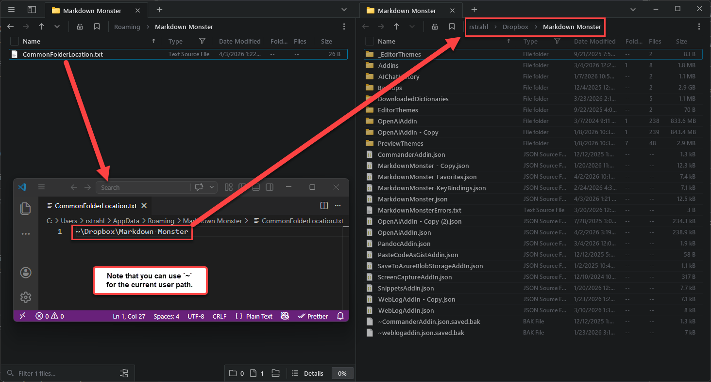

Markdown Monster's configuration settings are stored in a simple JSON file. The **default location** of the configuration file is:

```text
%appdata%\Markdown Monster\MarkdownMonster.json
```

and the file is simply editable either directly, or by using **Tools -> Settings**.

> If you're using a portable installation lives in `.\PortableSettings\MarkdownMonster.json` below MM installation folder you chose instead.

### Changing Configuration Folder to DropBox or OneDrive
You can also change the location configuration of the configuration folder using the **CommonFolder** setting in the Markdown Monster Settings at **Tools -> Settings**. 

For example you can set it to:

```text
~\Dropbox\Markdown Monster
```

or any any **valid** path you like. Note that you can and should use `~` for any user paths to minimize differences between multiple machines that might be accessing the same shared configuration file.

> Make sure the custom folder you configure exists. Markdown Monster will not create it and if it doesn't exist, reverts back to the default location. We recommend that you create the folder and copy the contents of your existing configuration folder to the new location explicitly **before you make the folder change**. Once you've verified it works, you can delete the old folder's content, but make sure you leave  `CommonFolderLocation.txt` in place as that determines where to look for the custom folder.

The common folder location is tracked in a separate configuration file **if it exists**. The file lives either in:

* `%appdata%\CommonFolderLocation.txt`  <small>*(default install)*</small>
* `<MM Install Folder>\PortableSettings\CommonFolderLocations.txt`  <small>*(portable install)*</small>

Here's what a custom folder location set to a DropBox folder looks like:



Note that changing this setting affects all configuration settings including settings for addins and other components. The original `%appdata%` or `.\PortableSettings` folder should only contain the `CommonFolderLocation.txt` file that uniquely points each user's installation at their preferred configuration folder location.

Once on a shared drive, configuration settings can now be accessed from multiple Markdown Monster instances that also are connected to this shared drive.

## When to use Shared Configurations
Shared Configurations work well if - and only if - you have similar machine setups regarding folder locations. MM uses stored file paths for many things, and if your folder setups are not matching you're likely to get mismatched locations.

Markdown Monster preemptively stores user folder paths using `~` whenever possible. But any files stored outside of user folders may have different locations may not map to another machine so